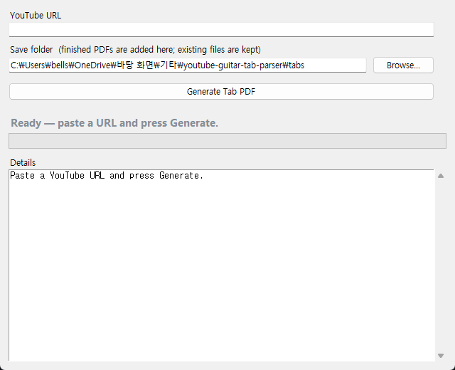
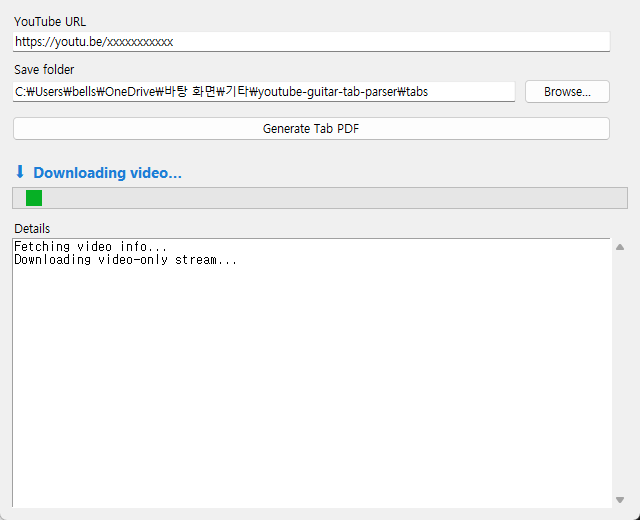
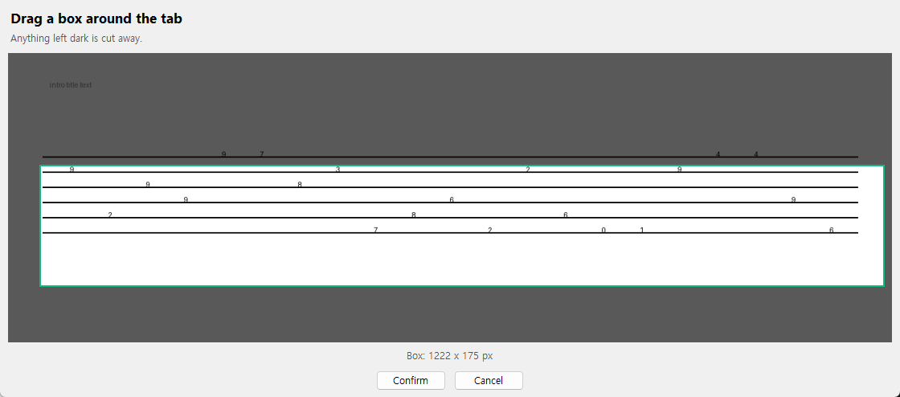
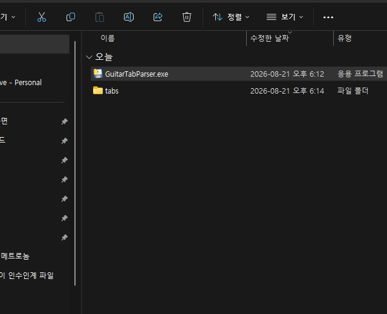

# YouTube Guitar Tab Parser

Turns a scrolling YouTube guitar tab video into a single PDF.

## Install

Download the zip for your OS from the [latest release](https://github.com/happylife10201020/youtube-guitar-tab-parser/releases/latest) and unzip it.

Windows: run `GuitarTabParser.exe`. Windows may warn that the app is unsigned. Click "More info", then "Run anyway".

macOS: run `GuitarTabParser.app`. If macOS blocks it, control-click the app and choose Open.

## Use

1. Paste a YouTube URL and click Generate Tab PDF.
2. A frame from the video appears. Drag a box around the tab area and click Confirm.
3. The PDF opens when done. It is saved in a `tabs` folder next to the app, named after the video. If that folder is not writable (for example, macOS ran the app from a read-only copy), it goes to `~/Documents/GuitarTabParser/tabs` instead. You can pick any folder with Browse.

| 1. Start | 2. Downloading |
|---|---|
|  |  |

| 3. Pick the tab area | 4. Done |
|---|---|
|  |  |

## What it does

- Downloads the video (video track only, so no ffmpeg needed)
- Crops every frame to the area you picked
- Drops duplicate lines and blank frames
- Trims measures that repeat between lines
- Joins everything into an A4 PDF

## Development

### Versioning

`version.py` holds the version (SemVer, `MAJOR.MINOR.PATCH`). To release, bump it and push a matching tag like `v1.2.0`. CI refuses to build a release if the tag and the file disagree.

### CI

- Push to `main`: dev builds (`GuitarTabParserDev`, with a Details log box) are uploaded as workflow artifacts.
- Push a `v*` tag: release builds (`GuitarTabParser`, no log box; logs go to `last-run.log` in the app data folder) are built for macOS and Windows and attached to the GitHub release.

### yt-dlp updates

YouTube changes often, and yt-dlp releases fixes just as often. A copy frozen into the app would go stale, so the app does not freeze it. The build ships yt-dlp as a wheel file. On first run the wheel is unpacked into the app data folder and loaded from there. On every start, a background check asks PyPI for a newer version and downloads it; the next start uses it.

App data folder: `~/Library/Application Support/GuitarTabParser` on macOS, `%LOCALAPPDATA%\GuitarTabParser` on Windows.

### Build by hand

Windows (Python 3.10+):

```bat
build_windows.bat                    :: dev build   -> dist\GuitarTabParserDev.exe
set RELEASE=1 && build_windows.bat   :: release     -> dist\GuitarTabParser.exe
```

macOS (must run on a Mac; PyInstaller cannot cross-build):

```sh
chmod +x build_mac.sh
./build_mac.sh               # dev build -> dist/GuitarTabParserDev.app
RELEASE=1 ./build_mac.sh     # release   -> dist/GuitarTabParser.app
```

### Run from source

```sh
git clone https://github.com/happylife10201020/youtube-guitar-tab-parser.git
cd youtube-guitar-tab-parser
python -m venv .venv
# Windows PowerShell: .venv\Scripts\Activate.ps1
# Windows cmd:        .venv\Scripts\activate.bat
# macOS/Linux:        source .venv/bin/activate
pip install -r requirements.txt
```

GUI:

```sh
python app.py
```

CLI:

```sh
python main.py "<youtube_url>" <output_dir>
```

`--overlap <0-1>` sets how much of each line to trim as overlap. Leave it out to auto-detect; pass 0 to turn trimming off.

## License

MIT. See [LICENSE](LICENSE).
